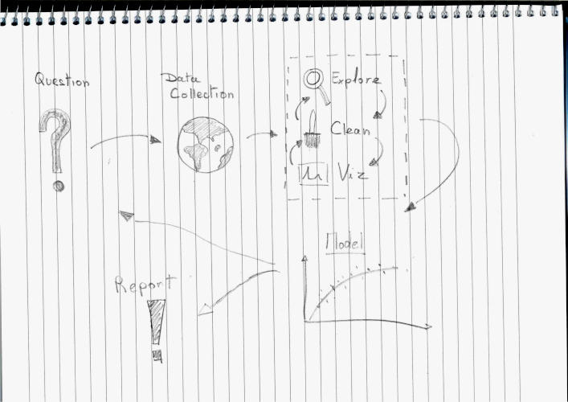
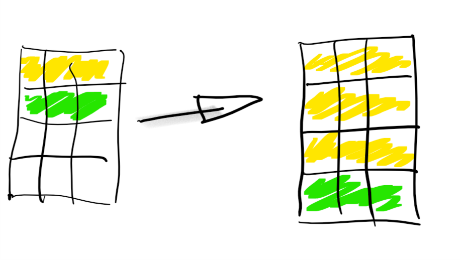
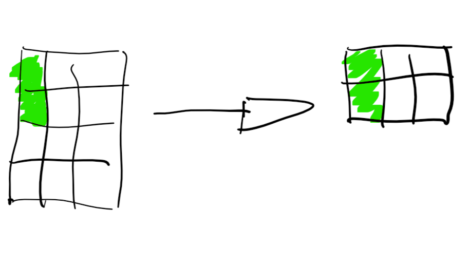
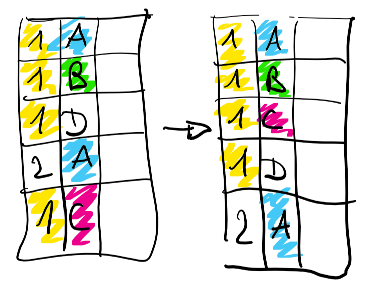
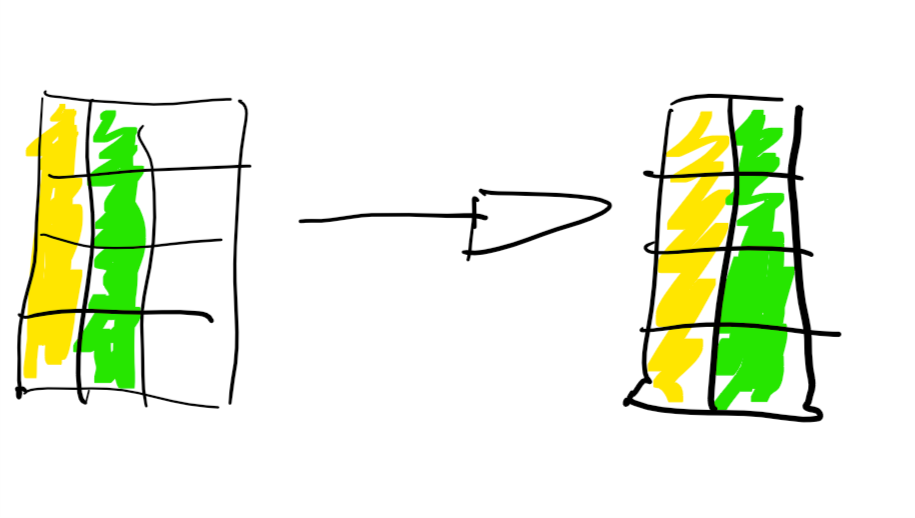
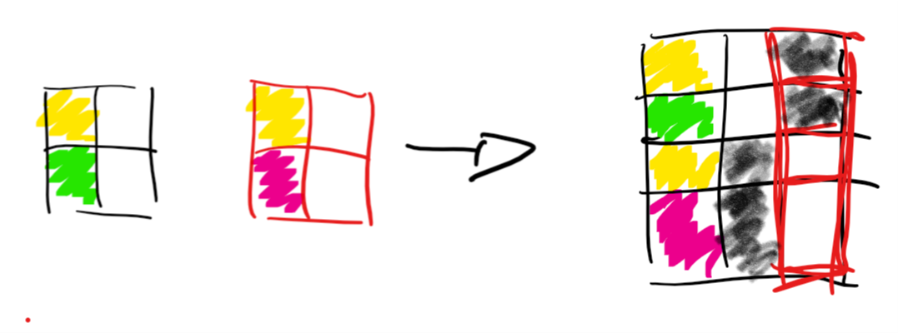
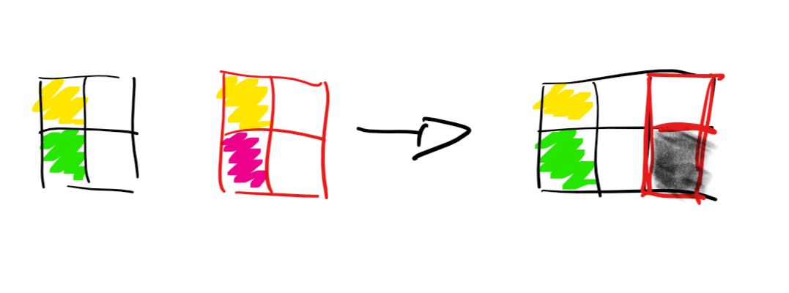
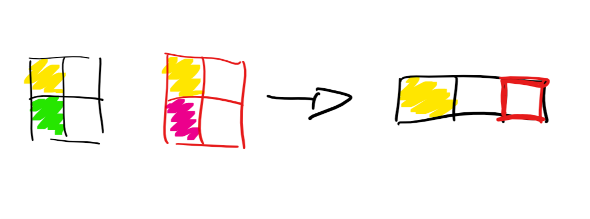
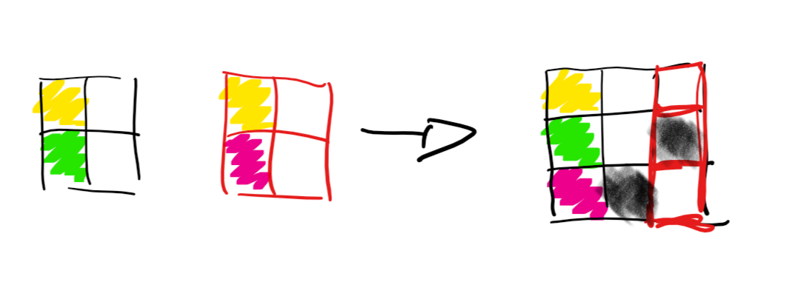

```{r setup, include=FALSE}
knitr::opts_chunk$set(echo = FALSE)
```

## Epidemiological study workflow



## Data manipulation tools {.build}


- `R` core function
- `dplyr`
- `data.table`
- `...`

## Tidyverse (from www.tidyverse.org)

<!-- \begin{columns} -->
<!-- \begin{column}{0.48\textwidth} -->
<!-- \begin{minipage}[c][0.9\textheight][c]{\linewidth} -->
<!--   \centering -->
<!--   \includegraphics[width=0.8\linewidth]{figs/tidyverse.png} -->
<!-- \end{minipage} -->
<!-- \end{column} -->
<!-- \begin{column}{0.48\textwidth} -->
<!-- \textbf{R packages for data science} -->

<!-- The tidyverse is an opinionated collection of R packages designed for data science. All packages share an underlying design philosophy, grammar, and data structures. -->
<!-- \end{column} -->
<!-- \end{columns} -->


**R packages for data science**

The tidyverse is an opinionated collection of R packages designed for data science. All packages share an underlying design philosophy, grammar, and data structures.

<!-- \begin{minipage}[c][0.9\textheight][c]{\linewidth} -->
<!--   \centering -->
<!--   \includegraphics[width=0.7\linewidth]{figs/tidyverse.png} -->
<!-- \end{minipage} -->


## pipe functions `%>%` {.build}


```{r eval=FALSE, echo=TRUE}
chill(fold(add(melt(add(chocolate, butter)),
               beat(add(eggs.white, cream))))
```

## pipe functions `%>%` {.build}

```{r eval=FALSE, echo=TRUE}
chill(fold(add(melt(add(chocolate, butter)),
               beat(add(eggs.white, cream))))
```

```{r eval=FALSE, echo=TRUE}
chocolate %>%
  add(butter) %>%
  melt() %>%
  add(
    eggs.white %>%
      add(cream) %>%
      beat()
  ) %>%
  fold() %>%
  chill()
```

## code as you speak

Data manipulation with `dplyr` is done using a limited number of **verbes** corresponding to an 
action to be applied to a table.

- `slice`
- `filter`
- `arrange`
- `select`
- `mutate`
- `group_by`
- `summarize`
- `join`
- ...


## select rows

```{r eval=FALSE, echo=TRUE}
dat %>% slice(c(1, 1, 1, 2))
```



## select columns

```{r eval=FALSE, echo=TRUE}
dat %>% filter(C1 == 'green')
```



## arrange rows

```{r eval=FALSE, echo=TRUE}
dat %>% arrange(C1, C2)
```




## columns selection

```{r eval=FALSE, echo=TRUE}
dat %>% select(C1, C2)
```



## group and summarize data

```{r eval=FALSE, echo=TRUE}
dat %>% group_by(C1) %>% summarize(C4 = mean(C2 + C3))
```


**note:** `summarise()` is an alias for `summarize()`

## bind and merge tables

```{r eval=FALSE, echo=TRUE}
dat1 %>% bind_rows(dat2)
```



## bind and merge tables

```{r eval=FALSE, echo=TRUE}
dat1 %>% left_join(dat2)
```




**note:** `right_join` will keep all rows of `dat2`

## bind and merge tables

```{r eval=FALSE, echo=TRUE}
dat1 %>% inner_join(dat2)
```




## bind and merge tables

```{r eval=FALSE, echo=TRUE}
dat1 %>% full_join(dat2)
```


