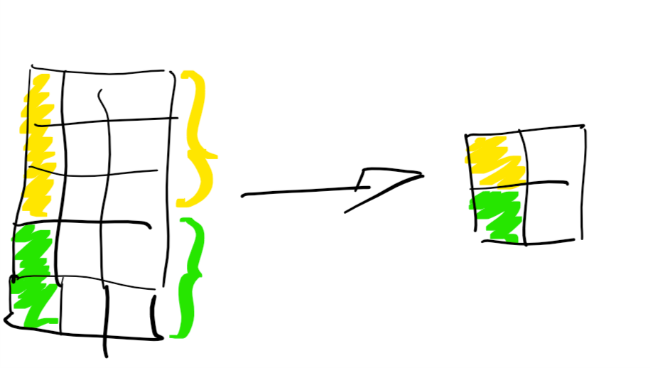

```{r setup, include=FALSE}
knitr::opts_chunk$set(echo = FALSE)
```

## Tidyverse (from www.tidyverse.org)

**R packages for data science**

The tidyverse is an opinionated collection of R packages designed for data science. All packages share an underlying design philosophy, grammar, and data structures. 


## code as you speak

Data manipulation with `dplyr` is done using a limitted number of **verbes** corespunding to action to be applied to a table.

- `slice`
- `filter`
- `arrange`
- `select`
- `mutate`
- `group_by`
- `summarize`
- ...


## select rows

```{r eval=FALSE, echo=TRUE}
dat %>% slice(c(1, 1, 1, 2))
```


## select columns

```{r eval=FALSE, echo=TRUE}
dat %>% filter(C1 == 'green')
```


## arrange rows

```{r eval=FALSE, echo=TRUE}
dat %>% arrange(C1, C2)
```


## columns selection

```{r eval=FALSE, echo=TRUE}
dat %>% select(C1, C2)
```


## group and summarize data

```{r eval=FALSE, echo=TRUE}
dat %>% group_by(C1) %>% summarize(C4 = mean(C2 + C3))
```



## bind and merge tables

```{r eval=FALSE, echo=TRUE}
dat1 %>% bind_rows(dat2)
```


## bind and merge tables

```{r eval=FALSE, echo=TRUE}
dat1 %>% left_join(dat2)
```


**note:** `right_join` will keep all rows of `dat2`

## bind and merge tables

```{r eval=FALSE, echo=TRUE}
dat1 %>% inner_join(dat2)
```


## bind and merge tables

```{r eval=FALSE, echo=TRUE}
dat1 %>% full_join(dat2)
```


