```{r setup, include=FALSE}
knitr::opts_chunk$set(echo = FALSE)
```

## Epidemiological study workflow

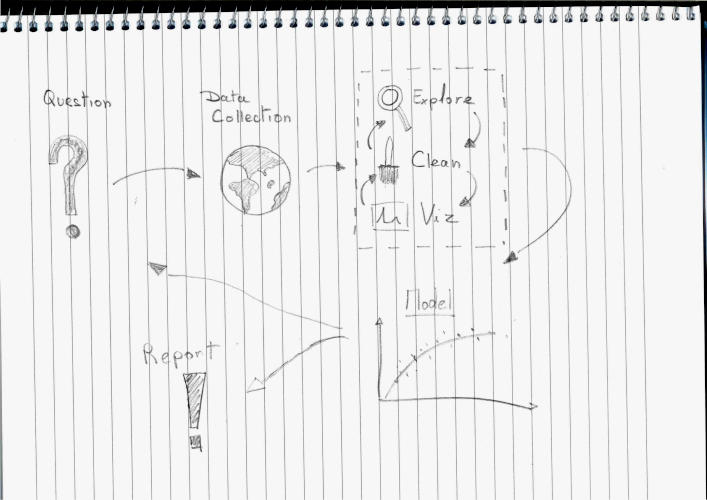

## Data manipulation tools in `R` {.build}

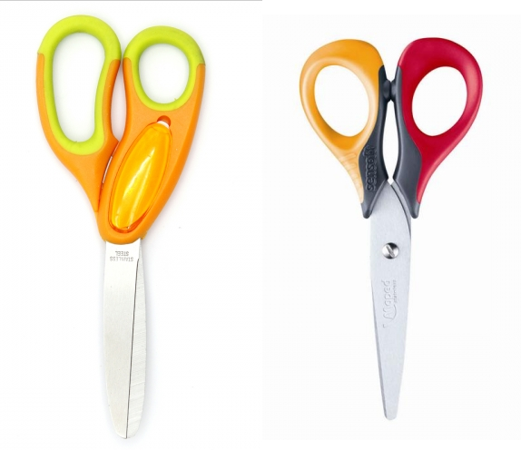

- `R` core function
- `tidyverse` / `dplyr`
- `data.table`
- `...`

=> The best tool is the one you feel the most comfortable with

## Tidyverse (from www.tidyverse.org)

<!-- \begin{columns} -->
<!-- \begin{column}{0.48\textwidth} -->
<!-- \begin{minipage}[c][0.9\textheight][c]{\linewidth} -->
<!--   \centering -->
<!--   \includegraphics[width=0.8\linewidth]{figs/tidyverse.png} -->
<!-- \end{minipage} -->
<!-- \end{column} -->
<!-- \begin{column}{0.48\textwidth} -->
<!-- \textbf{R packages for data science} -->

<!-- The tidyverse is an opinionated collection of R packages designed for data science. All packages share an underlying design philosophy, grammar, and data structures. -->
<!-- \end{column} -->
<!-- \end{columns} -->


**R packages for data science**

The tidyverse is an opinionated collection of R packages designed for data science. All packages share an underlying design philosophy, grammar, and data structures.

<!-- \begin{minipage}[c][0.9\textheight][c]{\linewidth} -->
<!--   \centering -->
<!--   \includegraphics[width=0.7\linewidth]{figs/tidyverse.png} -->
<!-- \end{minipage} -->

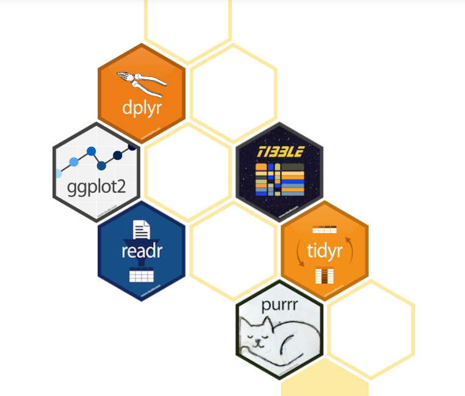

## pipe functions `%>%` or `|>` {.build}

```{r eval=FALSE, echo=TRUE}
chill(fold(add(melt(add(chocolate, butter)),
               beat(add(eggs.white, cream))))
```

## pipe functions `%>%` {.build}

```{r eval=FALSE, echo=TRUE}
chill(fold(add(melt(add(chocolate, butter)),
               beat(add(eggs.white, cream))))
```

```{r eval=FALSE, echo=TRUE}
chocolate %>%
  add(butter) %>%
  melt() %>%
  add(
    eggs.white %>%
      add(cream) %>%
      beat()
  ) %>%
  fold() %>%
  chill()
```

<!-- ## pipe functions `%>%` -->

<!-- ```{r eval=FALSE, echo=TRUE} -->
<!-- chill( -->
<!--   fold( -->
<!--     add( -->
<!--       melt( -->
<!--         add(chocolate, butter) -->
<!--       ), -->
<!--       beat( -->
<!--         add(eggs.white, cream) -->
<!--       ) -->
<!--     ) -->
<!--   ) -->
<!-- ``` -->

<!-- ```{r eval=FALSE, echo=TRUE} -->
<!-- chocolate %>% -->
<!--   add(butter) %>% -->
<!--   melt() %>% -->
<!--   add( -->
<!--     eggs.white %>% -->
<!--       add(cream) %>% -->
<!--       beat() -->
<!--   ) %>% -->
<!--   fold() %>% -->
<!--   chill() -->
<!-- ``` -->


## Non-standard evaluation rules for function calls
<!-- Evaluation of expressions in the context of the calling environment rather than the function's environment.  -->

- used in different R packages
- provide flexibility and ease of use
- more concise and expressive programming in R

```{r eval=FALSE, echo=TRUE}
dat <- data.frame(x = 1:10)
## subset supports NSE
subset(dat, x < 5)
## and SE
subset(dat, data$x < 5)
```

<!-- ## code as you speak -->

<!-- Data manipulation with `dplyr` is done using a limited number of **verbs** corresponding to an  -->
<!-- action to be applied to a table. -->

<!-- - `slice` -->
<!-- - `filter` -->
<!-- - `arrange` -->
<!-- - `select` -->
<!-- - `mutate` -->
<!-- - `group_by` -->
<!-- - `summarize` -->
<!-- - `join` -->
<!-- - ... -->


<!-- ## select rows -->

<!-- ```{r eval=FALSE, echo=TRUE} -->
<!-- dat %>% slice(c(1, 1, 1, 2)) -->
<!-- ``` -->

<!-- 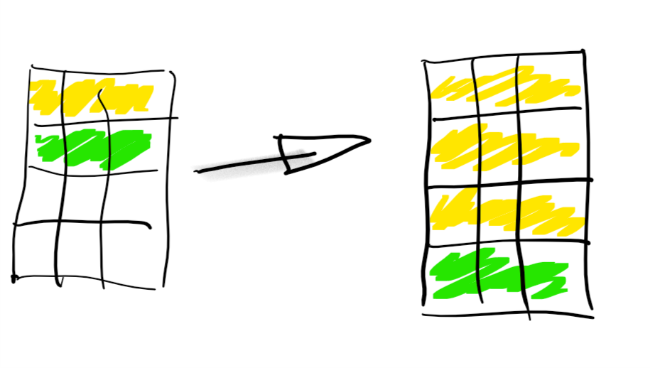 -->

<!-- ## select columns -->

<!-- ```{r eval=FALSE, echo=TRUE} -->
<!-- dat %>% filter(C1 == 'green') -->
<!-- ``` -->

<!-- 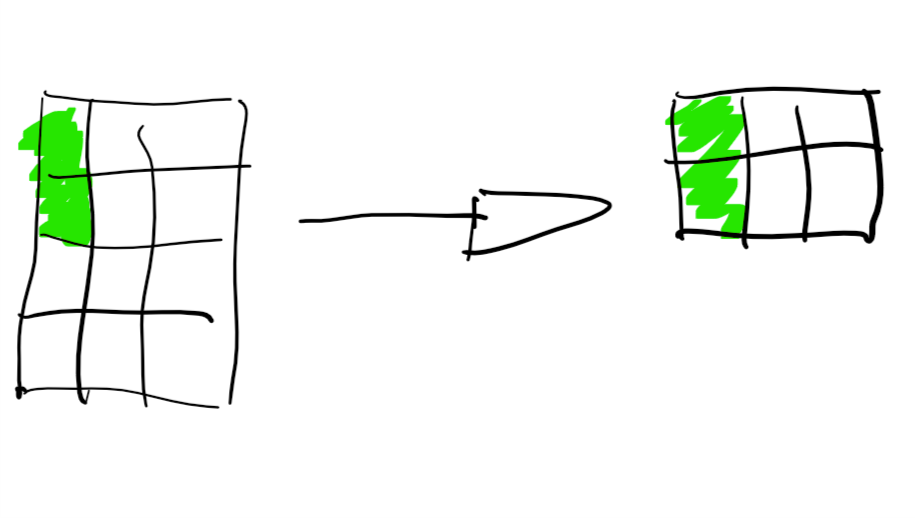 -->

<!-- ## arrange rows -->

<!-- ```{r eval=FALSE, echo=TRUE} -->
<!-- dat %>% arrange(C1, C2) -->
<!-- ``` -->

<!-- 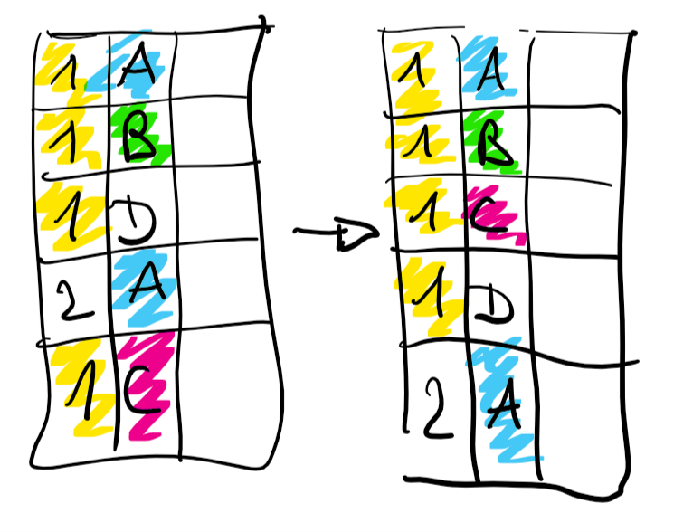 -->


<!-- ## columns selection -->

<!-- ```{r eval=FALSE, echo=TRUE} -->
<!-- dat %>% select(C1, C2) -->
<!-- ``` -->

<!-- 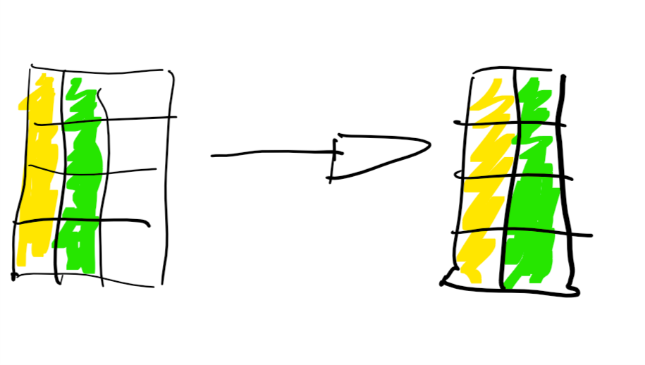 -->

<!-- ## create/modify columns -->

<!-- ```{r eval=FALSE, echo=TRUE} -->
<!-- dat %>% mutate(C4 = C1 + C2 + C3) -->
<!-- ``` -->

<!-- 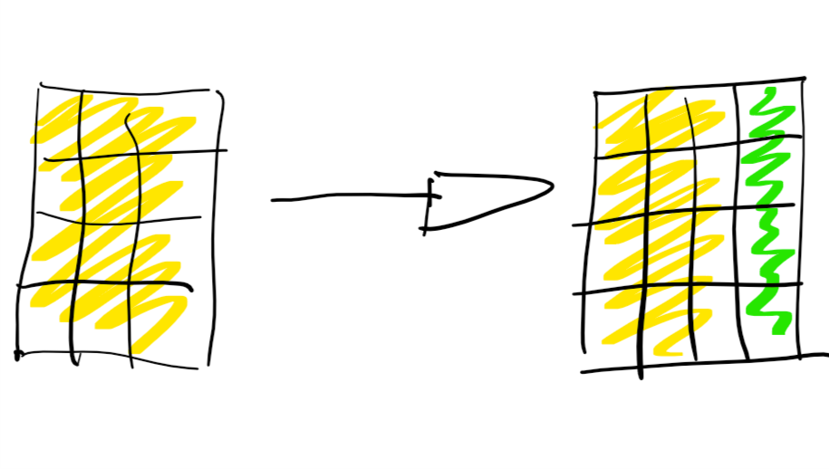 -->

<!-- ## group and summarize data -->
<!-- ```{r eval=FALSE, echo=TRUE} -->
<!-- dat %>% group_by(C1) %>% summarize(C4 = mean(C2 + C3)) -->
<!-- ``` -->

<!-- 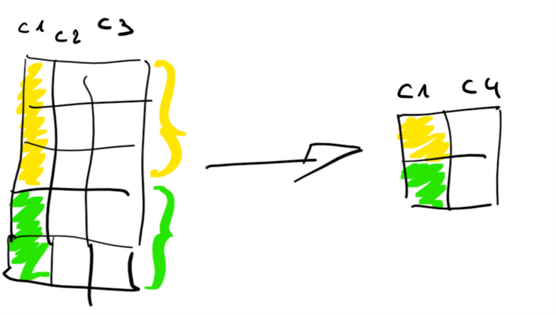 -->

<!-- **note:** `summarise()` is an alias for `summarize()` -->

<!-- ## bind and merge tables -->

<!-- ```{r eval=FALSE, echo=TRUE} -->
<!-- dat1 %>% bind_rows(dat2) -->
<!-- ``` -->

<!-- 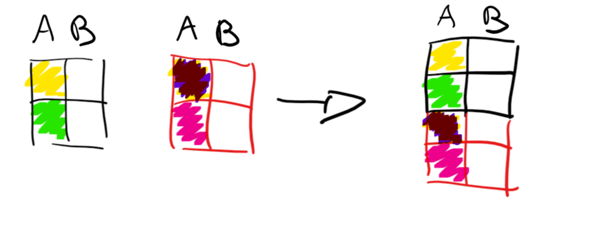 -->


<!-- ## bind and merge tables -->

<!-- ```{r eval=FALSE, echo=TRUE} -->
<!-- dat1 %>% bind_rows(dat2) -->
<!-- ``` -->

<!-- 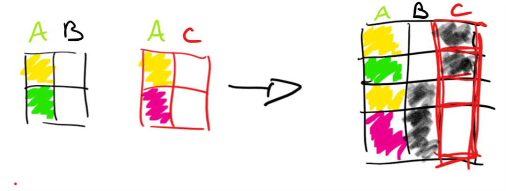 -->

<!-- ## bind and merge tables -->

<!-- ```{r eval=FALSE, echo=TRUE} -->
<!-- dat1 %>% left_join(dat2) -->
<!-- ``` -->


<!-- 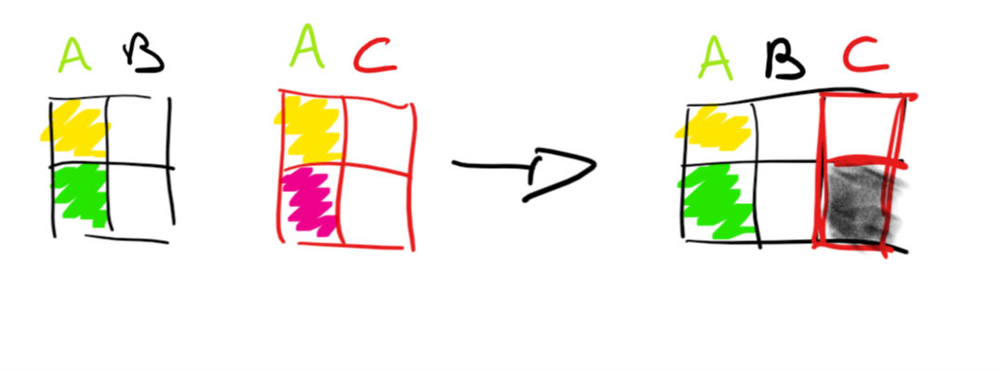 -->

<!-- **note:** `right_join` will keep all rows of `dat2` -->

<!-- ## bind and merge tables -->

<!-- ```{r eval=FALSE, echo=TRUE} -->
<!-- dat1 %>% inner_join(dat2) -->
<!-- ``` -->


<!-- 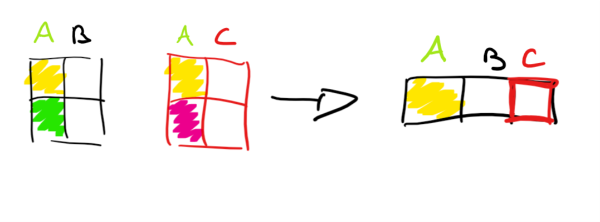 -->

<!-- ## bind and merge tables -->

<!-- ```{r eval=FALSE, echo=TRUE} -->
<!-- dat1 %>% full_join(dat2) -->
<!-- ``` -->

<!-- 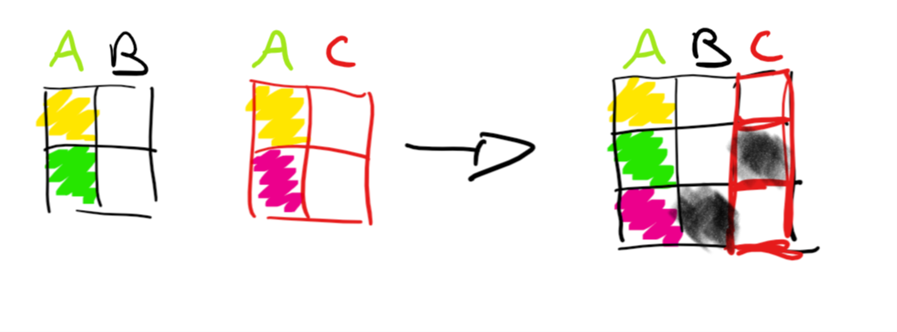 -->


## data manipulation with {height=10%} 

**Code as you speak:** 
Data manipulation with `dplyr` is done using a limited number of **verbs** corresponding to an 
action to be applied to a table.

>- select rows (`slice`)
>- filter rows (`filter`)
>- arrange rows (`arrange`)
>- select columns (`select`)
>- create/modify columns (`mutate`)
>- group and summarize data (`group_by` and `summarise`)
>- bind different tables (`bind_rows`, `bind_cols`)
>- merge different tables (`left_join`, `right_join`, `inner_join`, `full_join`)

## discovering other `tidyverse` packages features

>- data visualization with {height=10%} (`ggplot`, `geom_bars`, ...)
>- pivoting data with {height=10%} (`pivot_wider`, `pivo_longer`)
>- reading data with {height=10%} (`read_table`, `read_csv`)
>- manipulating lists with {height=10%} (`map`, `map_chr`, `reduce`, ...)
>- manipulating strings with {height=10%} (`str_length`, `str_remove`, ...)

```{r eval=FALSE, echo=FALSE}
## trick to create tidyverse-booklet.Rmd file.
## this part have to be launch manually
pres.path <- '~/OneDrive - IARC/PROJECT/_SPE/SPE/lectures/tidyverse/tidyverse-pres.Rmd'
pres <- readLines(pres.path)
pres_b <- purrr::map_chr(pres, ~ stringr::str_replace(.x, '>-', '-'))
pres_b.path <- stringr::str_replace(pres.path, 'tidyverse-pres', 'tidyverse-booklet')
writeLines(pres_b, pres_b.path)
rmarkdown::render(pres_b.path, output_file = stringr::str_replace(pres_b.path, '.Rmd', '.pdf'))
```


