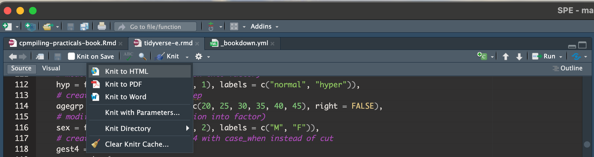

Compiling SPE-R practicals book
=====================

## Preamble

A new version of the practicals book based on markdown/bookdown is available in `pracs-book` directory. The master file is `_bookdown.yml` where the parameter `rmd_files:` indicate the chapter order based on individual files names. This is the files you should edit.

```markdown
rmd_files: ["index.Rmd", 
  "basic-e.rmd", "dinput-e.rmd",
  "tidyverse-e.rmd", "tab-e.rmd", "graph-intro-e.rmd", "rates-rrrd-e.rmd",
  "effects-e.rmd", "cont-eff-e.rmd", "causal-e.rmd",
  "graphics-e.rmd", "oral-e.rmd", "DMDK-e.rmd", "occoh-caco-e.rmd",
  "causInf2-e.rmd", "renal-e.rmd"]
```

## Compiling the files

When you are working on a file and you want to check the render ou could click on `Knit` button in `Rstudio`.



Note that you can choose the output format clicking on the down arrow just right to the button.

Compiling individual files is handy when you are developing/editing your own practical.

That being said, It is advise also to try to compile the entire book before to `push` your files online

## Compiling the book

If you want to compile the book you should use `bookdown` package (see. <https://bookdown.org/yihui/bookdown/> for a detailed guide)

To compile the `HTML` version just type:

```r 
options(knitr.duplicate.label = "allow")
bookdown::render_book('pracs-book/', 'bookdown::gitbook', clean = TRUE, new_session = TRUE)
```

For the `pdf` one:

```r
options(knitr.duplicate.label = "allow")
bookdown::render_book('pracs-book/', 'bookdown::pdf_book', clean = TRUE, new_session = TRUE)
```

This will create a `SPE-R-2024-practicals` directory in which all the needed compiled files are stored.

To open the website, open `SPE-R-2024-practicals/index.html` file in your web browser. To open the \`pdf\` version of the book, open `SPE-R-2024-practicals/SPE-R-2024-practicals.pdf`
