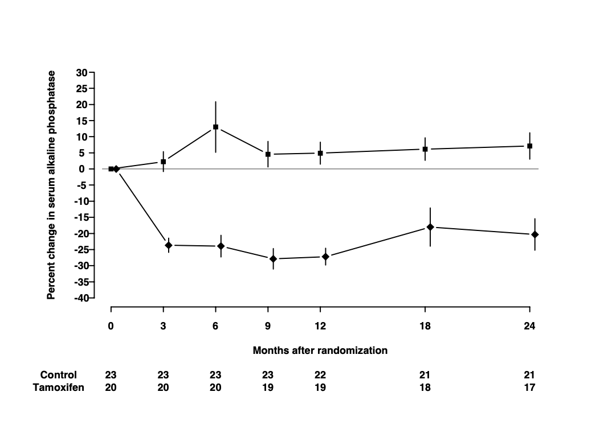

```{r, include=FALSE}
knitr::opts_chunk$set(results = "hide", 
                      fig.show = "hide",
                      keep.source = TRUE,
                      eps = FALSE,
                      include = TRUE,
                      prefix.string = "./graph/graphics")
```

# Graphics with ggplot2

The plot below is from randomized study of the effect of Tamoxifen treatment on bone mineral metabolism in a group of patients who were treated for breast cancer (Kristensen et al, 1994). It is reproduced with permission from the author Peter Dalgaard who has also shared the original data.



The purpose of this exercise is to show you how to build a similar plot in R using the `ggplot2` package.

The outcome of the study is the percentage change in serum alkaline phosphate compared with the baseline when the participants first entered the study. The first measurement, on the left of the plot, is zero by definition. Then as we move from left to right, the plot shows the relative changes for the two groups of women: one receiving the anti-cancer drug tamoxifen; the other receiving standard treatment which is referred to as the *control* group. Each woman was randomly allocated to one of these groups on entry to the study. The women returned for follow-up visits until the end of the study at 24 months.

Take a moment to study the graph and try to identify the different graphical elements that we will need to reproduce. Write down a description of these elements and compare it to my summary below.

-   The trajectory of the outcome variable is represented by points connected by straight lines. One point represents the mean value for one follow-up visit in one of the groups.
-   Separate trajectories are plotted for the treatment and control groups.
-   Vertical error bars give a visual impression of the uncertainty associated with each point.
-   A horizontal line at zero is drawn as a reference so that we can see the size of the change relative to baseline.
-   The x-axis has tick marks at follow-up visits, which are irregularly spaced. Visits occurred every 3 months for the first year, then every 6 months for the second year.
-   The y-axis extends beyond the range of the data from -40% to +30%.
-   A table underneath the x-axis shows the number of women in the treatment and control groups at each visit. These numbers go down as the study progresses. This phenomenon is extremely common in medical studies and is called "loss to follow-up".

These are the important graphical elements. You may have spotted some other features of the graph, but we will focus on trying to incorporate the features listed above.

## Data

The data are available in the file `alkfos.csv`. This is a text file in comma-separated variable format. It can be read into R using the `read.csv()` function.

```{r}
alkfos <- read.csv("./data/alkfos.csv")
```

There are 14 rows in the data frame `alkfos`: one for each combination of the 7 visits and the 2 groups. The variables in the data frame are:

-   `time` The time since randomization for each follow-up visit.
-   `mean` The outcome variable representing the mean percentage change in serum alkaline phosphate.
-   `available` The number of women still participating in the study.
-   `treat` The treatment group: a character vector taking values "tamoxifen" for the treatment group and "control" for the control group.
-   `sem` The standard error of the mean used to calculate the length of the error bars.

## Building the plot

### The ggplot2 package

In this exercise, we will be using the R package ggplot2. The "gg" stands for "Grammar of Graphics", which is a conceptual framework for understanding statistical graphics created by Leland Wilkinson.

The core function in the ggplot2 package is `ggplot()`. This function requires two arguments:

-   `data` is the name of the data frame that we will take the variables from.
-   `mapping` is the *aesthetic mapping* between variables in the data frame and graphical elements that we want to plot. In this example:
    -   y-axis is the mean of the percent change in alkaline phosphate represented by the variable `mean;`
    -   x-axis is the visit time represented by the variable `time.`

We make the mapping in a call to the function `aes()`.

The code below creates a basic plot and assigns it to the object `p0`.

```{r}
library(ggplot2, quietly=TRUE)
p0 <- ggplot(data=alkfos, mapping=aes(x=time, y=mean))
```

Running the code creates the plot but does not display it. This is an important difference between base graphics and ggplot graphics:

-   Base graphics functions do not return an R object but will always display a plot on the current graphics device.
-   GGplot graphics functions return an R graphical object, which will only be displayed if we ask for it.

There are two ways to display a graphical object in R:

1.  If we have saved the result to an object, call the `print()` or `show()` functions.
2.  If we have not saved the result, the graphical object will be displayed in the same way that a regular R object is printed to the screen.

The code chunk below displays the object `p0` created in the chunk above.

```{r}
show(p0)
```

You may find the results a little disappointing. The `ggplot()` function has drawn x- and y-axes that span the range of the data, but otherwise has drawn no points or lines. This is another important difference between ggplot2 and base graphics. Whereas base plotting functions will usually create a sensible default plot, `ggplot()` makes no assumptions about what you want.

We will recreate the plot in *layers*. Layers are added to a ggplot object by calling additional functions and adding their return value to the basic plot using the `+` symbol.

### Geometries

The most important layers are *geometries*, which describe how to display the data in the plot. Geometry functions in ggplot2 all start with the prefix `geom_`.

#### Points and lines

We want to plot points representing the mean of the outcome at each visit. This is done with the function `geom_point()`. We also want to plot lines between successive points in time. This is done with the function `geom_line()`. The code chunk below adds point and line geometries to our basic plot `p0` and saves the result to the new object `p1`.

```{r}
p1 <- p0 + geom_point() + geom_line()
show(p1)
```

Again, this is not quite what we want. The line geometry is mixing up observations from the treatment and control groups, but we want separate lines for each group. To obtain this we need to add an additional aesthetic mapping inside the call to `ggplot()`. The aesthetic `group` gives the name of the variable in the data frame that distinguishes observations from different groups.

Modify the code chunk below so that it includes the `group` aesthetic to recreate plot `p1` correctly.

```{r, eval=FALSE}
p1 <- ggplot(data=alkfos, mapping=aes(x=time, y=mean)) +
  geom_point() + geom_line()
show(p1)
```

#### Error bars

Now we can add the error bars. These can be added using the `linerange` geometry. This geometry needs some new aesthetic mappings. It will inherit the `x` mapping from the call to `ggplot()`. However, it needs new mappings `ymin` and `ymax` giving the lower and upper points of the error bar on the y-axis. We could go back and modify the aesthetic mappings in the call to `ggplot()`. However, we can also supply aesthetic mappings inside the call to a geometry function. It can be useful to do this when an aesthetic is only used by one geometry (which is the case here).

Modify the code chunk below so that the `linerange` geometry has its own aesthetic mapping for `ymin` and `ymax`.

-   `ymin` is the mean minus the standard error
-   `ymax` is the mean plus the standard error

Note that the error bars are *not confidence intervals*. In statistical graphics it is very common to use plus/minus the standard error to represent the uncertainty in the data without making any statistical claims about coverage.

```{r, eval=FALSE}
p2 <- p1 + geom_linerange(...)
show(p2)
```

Compare the y-axes for plots `p1` and `p2`. Note that when we add the error bars, the y-axis automatically expanded the limits of the y-axis to include the highest and lowest values on the error bars.

#### Horizontal reference line

The last geometry we want to add is the horizontal reference line at zero. This is added using the `hline` geometry. We must supply the argument `yintercept` which determines where the horizontal line intersects the y-axis.

We should distinguish the reference line from the lines used to plot the data, otherwise it may distract the viewer. We could do this by changing the colour of the reference line. But here we will use a thinner line using the optional argument `linewidth` to the hline geometry. The default value of `linewidth` is 1. A value less than 1 draws a thinner line; a value greater than 1 draws a thicker line. Choose a suitable value for your plot.

```{r, eval=FALSE}
p3 <- p2 + geom_hline(...)
show(p3)
```

### Scales

Next we want to fix the x- and y-axes. The `ggplot()` function will provide default axes for you, which are often good enough. But in this case we want custom axes. These are provided by scale functions. In fact axes are just one kind of scale. In the grammar of graphics framework, a scale is a way to annotate any quantity that represents a dimension of the data. This also includes shapes, colours, and sizes.

Both axes are continuous. Therefore we use the `scale_x_continuous()` and `scale_y_continuous()` functions to create custom axes. These scale functions have the same arguments, but they affect the x- and y-axes, respectively. The arguments you want to supply are

-   `breaks` A numeric vector of positions on the axis where you want tick marks.
-   `limits` A numeric vector of length 2 giving the minimum and maximum values to be displayed on the axis.

Modify the code chunk below to create the custom axes:

```{r, eval=FALSE}
p4 <- p3 + scale_x_continuous() + scale_y_continuous()
show(p4)
```

We should also supply informative axis labels. The default axis labels are taken from the names of the variables that we used in the aesthetic mappings for `x` and `y`. Use the `xlab()` and `ylab()` functions to provide informative axis labels.

```{r, eval=FALSE}
p5 <- p4 + xlab(...) + ylab(...)
show(p5)
```

### Themes

Our plot contains most of the same graphical elements as the reference plot. But it does not look the same. The original plot was drawn on a white background. But our plot has a grey background with white major and minor grid lines.

Themes control many aspects of the appearance of the plot that do not depend on the data. The default theme, which we have been using so far, is called `theme_gray()`. Use the `help()` function to look up `theme_gray()` and you will see the help page documents the other complete themes provided by the ggplot2 package.

-   Modify the chunk below to use different themes until you find one that most closely matches the original plot in the file bentK.pdf.
-   Find the parameter that changes to the font size and use it to reduce the font until the y-axis label fits.

```{r, eval=FALSE}
p6 <- p5 + ...
show(p6)
```

### Putting everything together

In this exercise, you have constructed the plot in steps, saving and displaying the plot in separate chunks to allow you to see the changes as we add each layer of the plot. In practice, we do not work like this. All the instructions for creating the plot should be together. Fill in the chunk below so that the plot is recreated in a single chunk.

```{r, eval=FALSE}
p <- ...
show(p)
```

There is still one thing missing from our reproduction. In the original plot, the treatment and control groups were distinguished by different plotting symbols, whereas in our plot they both have circular marks. We can change this by adding the aesthetic mapping `shape`.

Modify the chunk above so that the aesthetic shape is mapped onto the variable treat. You can do this inside the call to `ggplot()` or in the call to `geom_point()`.

Note that adding the shape aesthetic automatically adds a legend to the plot, telling us which shape corresponds to which group.

## Self study

Congratulations, you have mostly recreated the reference figure from Kristensen et al (1994). However, have you really learned anything? The best way to find out is to come back in a week's time and try to recreate the reference plot without looking at this exercise sheet.

You may find it useful to download the ggplot cheatsheet. You can also use R help to find out more about the functions in the ggplot2 package. Finally, you can refer to the book Ggplot2: elegant graphics for data analysis by Hadley Wickham, creator of the ggplot2 package.

## Adding the table (advanced topic)

There is one important element missing from the graph. This is the table of the number of participants in each group. This is an advanced topic so instead of explaining each step I am just going to give you the solution. Do not be concerned if you do not understand this part.

Firstly we create a new graphical object to represent the table. This object has its own aesthetic mappings, geometries and scales. I will skip a detailed description of this step except to note that some of the arguments below will suppress graphical features (e.g. `NULL` and `element_blank()`)

```{r, eval=FALSE}
tab <- ggplot(data=alkfos, 
              mapping=aes(x=time, y=treat, label=available)) +
              geom_text(size=2) + xlab(NULL) + ylab(NULL) +
              scale_x_continuous(breaks=NULL) + 
              theme_bw(base_size=9) +
              theme(panel.grid=element_blank())
tab
```

Next use the `plot_grid()` function from the cowplot package to stack the displayed objects vertically (`align="v"`), in a single column (`ncol=1`, `nrow=2`), with the left and right ends of the x-axes aligned (`axis="lr"`) and most of the space taken up by the plot (`rel_heights=c(5,1)`).

```{r, eval=FALSE}
library(cowplot)
plot_grid(plotlist=list(p, tab), align="v", axis="lr", 
          ncol=1, nrow=2, rel_heights=c(5,1))
```

## References

Kristensen B, Ejlertsen B, Dalgaard P, Larsen L, Holmegaard SN, Transbøl I, Mouridsen HT. Tamoxifen and bone metabolism in postmenopausal low-risk breast cancer patients: a randomized study. *J Clin Oncol*. 1994 May;**12(5)**:992-7. doi: 10.1200/JCO.1994.12.5.992. PMID: 8164053.
